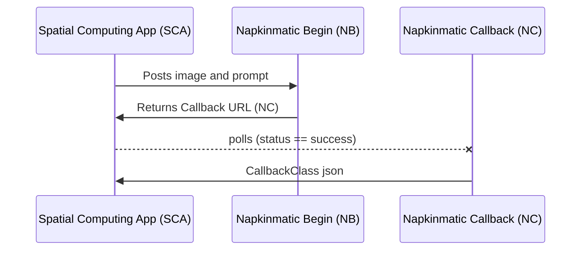

# napkinmatic


## Architecture Overview 

Napkinmatic is a FOSS spatial computing framework for backend and traditional full-stack developers to easily interface their AI serverside apps with a mobile-native-Unity AR app. 

The Spatial Computing App (SCA) refers to the mobile-native-Unity app, and Napkinmatic* refer to the serverside endpoints, with parameters defined below. 

**Note: you don't have to worry about the SCA or the frontend. Simply setup your serverside endpoints as defined in backend below.**

The call architecture works like this: 



### Frontend
Design your UI using React UIElements / Typescript. 

This may make sense once you watch the [Napkinmatic](https://napkinmatic.com) video

##### Included/Required UI Elements

 1. Create augmentable surface (currently, top down photo assuming parallel to plane)
 2. Capture image to be sent (in example, currently combined with above step)
 3. Enter prompt and submit
 4. Waiting/Progress (optional)
 5. Data returned UI set (optional)

 ##### Additional js functionality support 

The image becomes a surface in 3-space, so you can assume the usual raycast data like point and normal hit, etc. For example: You can also write additional functionality using javascript, such as this mini hack made at a [GDC 2023 AI Games hackathon giving you the ability to play paintball on your AI image](https://devpost.com/software/paper-set-multiplayer)!

### Serverside

The serverside includes two general endpoint: the first to begin the call and the second is a polled callback that eventually returns the result when successfully processed. It is agnostic other than some standardized data structures described below. 

#### Endpoint URLs

 - Napkinmatic Begin (NB) - accepts POST parameters `image` and `prompt`
 - Napkinmatic Callback (NC) - this is polled as the results are being processed, return `status: success` in the JSON format defined below for `CallbackClass`. `output` is a url array of images. (The controlnet demo app uses output[1] by default)

````
public class CallbackClass
{
    public string id;
    public string status;
    public string[] output;
}
````
