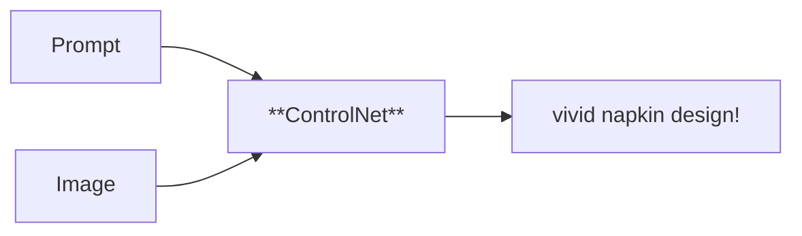
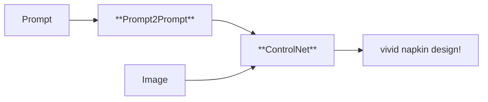
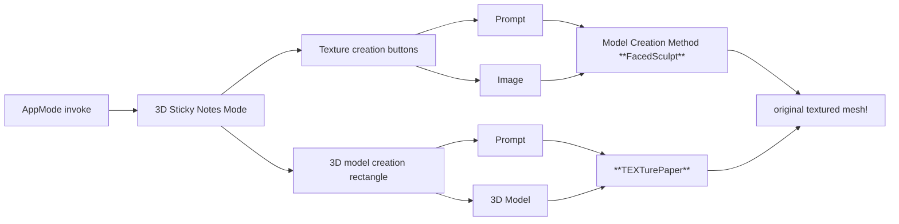

# Napkinmatic Spatial Computing Platform

 Napkinmatic is a robust spatial computing platform connecting the real world to AI and back again in AR. The name derives from how the platform can turn your proverbial napkin sketch wireframe into a working website or app (GPT4 multi-modal), with several design sets to choose from (ControlNet), all augmented back on the napkin, so that you can interface with the app "in real time, in reality". The platform features an [opensource framework](https://github.com/yosun/napkinmatic) which allows anyone to swap out the model with the latest SOTA by updating endpoints, as well as a built-in javascript engine for AppMode. 

## Examples 

### SOTA Endpoint Usage and Chaining

#### Controlnet-Scribble to turn sketches into masterpieces

#### Prompt2Prompt for Quick Design Iterations

#### TEXTurePaper for automatic texturing of 3D Meshes

### Using the built-in JS engine to add interactivity 

#### Connect UI with 3D models 

#### Raycasting to Napkin Surface
We raycast paintball splatters on "napkin" in our GDC23 AIGames Hackathon entry [PaperSet Multiplayer](http://paperset.art/) and  [Instagram short here](https://www.instagram.com/p/CqaXQjEvxaA/)  and it won 2 prizes, enough to cover SF rent for a month! 

